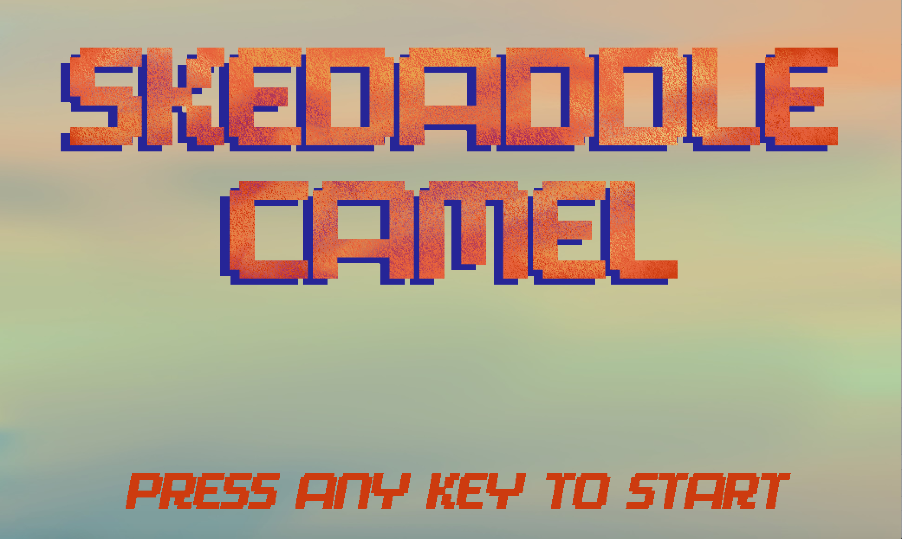

# Skedaddle Camel

Skedaddle Camel is a new spin on the classic maze game. Play as the titular Camel and escape a series of increasingly difficult mazes, collecting coins, navigating power-tiles, defeating enemies, and catching genies as you go.

## How To Play
Control the camel using WASD, and press the space bar to shoot globs of spit-shaped projectiles at your enemies
The objective of the game is to navigate the maze from the entrance portal to the exit, collecting as many coins and defeating as many enemies as you'd like along the way.

## Key Features
* random maze generation (with random power-tile, coin, power-up, and enemy placement)
* three levels of increasing difficulty
* three types of power-tiles 
  * randomly spawned portals
  * mud tiles that slow you down
  * ice tiles that speed you up (careful! you lose control of the camel too)
* score keeping
* in-game timer
* two game modes (easy and hard) - in hard, escape the maze before the timer runs out!

## Description

In this OCaml adaptation of the maze game, the player is a camel navigating a series of increasingly difficult mazes. The player can set the difficulty: easy or hard. Mazes are populated with power-ups, such as ‘potions’ to gain more health and ‘hourglasses’ to gain more time (if in hard mode), and obstacles in the form of randomly spawned power-tiles. Enemy camels move dynamically around the maze. If the player's camel comes within five pixels of an enemy camel, it loses a life. Plans for future functionality expansion include implementing sound effects, auto-replay, and greater player character customization.

## Authors
Created as a final project for Fall 2020 CS3110 at Cornell University :camel::genie_man::camel:

Linda Huang (linda-huang), Doanh Tran (DoanhTran), Anna Effenberger (annaeffen), Tina Li